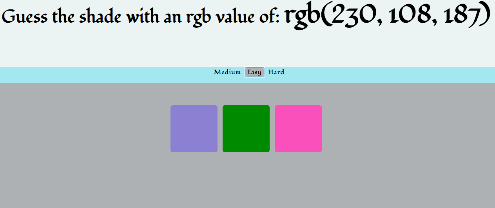
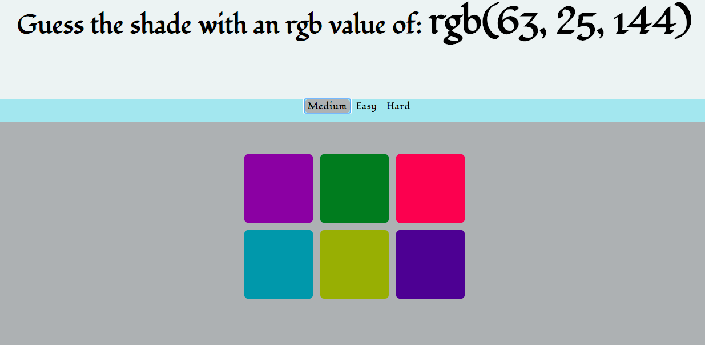
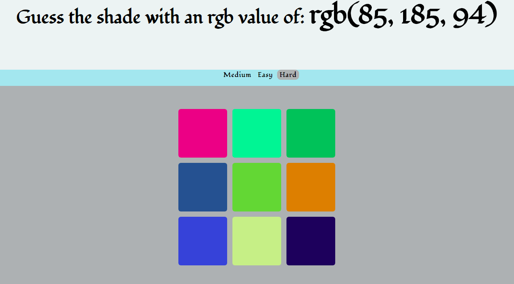

# Guess the shade

Guess the correct colour based on its rgb value.
Easy mode: choose from a selection of three colours
Medium mode: choose from a selection of six colours
Hard mode: choose from a selection of nine colours

### How to run:
* Clone this repo:
```html
git clone https://github.com/emilyjspencer/Guess-the-shade.git
```
* Navigate into the repo:
```html
cd Guess-the-shade
```
* Open the index.html file with your chosen browser


### Built with:
* Vanilla JavaScript
* CSS

# What it looks like:





# Temporarily deployed with Surge at:
profuse-swing.surge.sh

